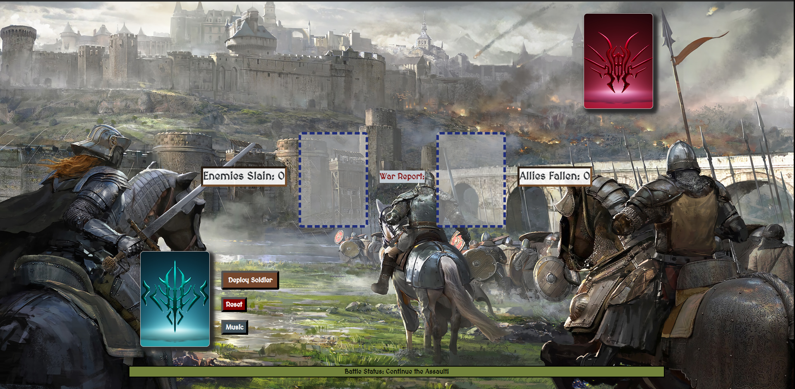

# The Rhythm of WAR!!

## Click [here](https://therhythmofwar.netlify.app/) to play the game!

## Objective and Inspiration:

As part of my Software Engineering Immersive cohort with General Assembly, we were asked to create a browser-based game for our Unit 1 Project. I have been a fan of the simplicity of the card game War since I was a child, but I decided to add my own flair to the typical gameplay loop. Before starting the cohort, I had just finished the first three books of Brandon Sanderson's The Stormlight Archive, and when I decided to build this game, I knew immediately what the theme would be. A back-and-forth battle, where soldiers "lost" would be removed from the game completely and placed into a points counter, making the stakes of every battle that much greater.

Check out my original planning materials [here](https://docs.google.com/document/d/115D1f_OBE88AUdPDPIfV24ZAs6C4PHFjqykQgS8Zia4/edit).

## What is War?

War is a simple card game! You begin by shuffling the deck and dealing 26 cards to each of the two players. Each player takes the top card of their deck and places it face up. The card that has the highest value wins. If the two cards have the same value, you proceed to WAR! In WAR!, each player plays 3 cards face down. Then, the next card is flipped faced up. The player with the higher card value wins and receives all 10 cards as a reward. In the event of a second WAR!, the game declares a Draw, and each player gets the soldiers they sent to WAR! (5 cards each) as points. At the end of the game, the player with more points wins.

## Technologies Used: 

- JavaScript
- CSS
- HTML
- Git 
- animate.css

## Credits:

- IngeDnD (https://imgur.com/user/ingednd/posts) for the background image
- Sword favicon created by Freepik - Flaticon
- Michael Ghelfi Studios (https://michaelghelfi.bandcamp.com/) for the background ambient soundtrack
- /u/Persia029 on Reddit for the card deck images
- Card images provided by General Assembly (https://github.com/SEI-Remote/css-card-deck)
- The Fisher–Yates shuffle algorithm is used for shuffling the decks. You can find out more about the Fisher-Yates algorithm [here](https://bost.ocks.org/mike/shuffle/)

## Stretch Goals:

- Optimize experience for Mobile
- Deck Image selection
- Add more robust animations for War scenarios